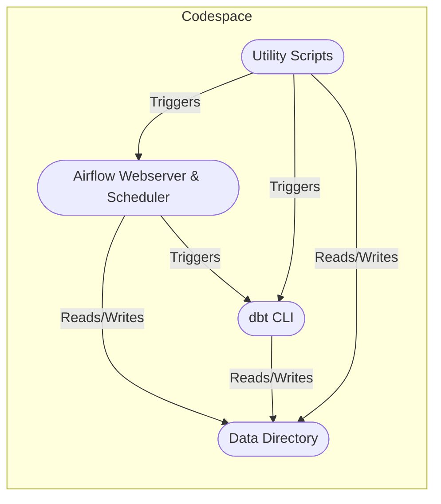

# Architecture Specification Template

## 1. Overview
- Purpose and scope of the architecture
- System context and high-level objectives

## 2. System Architecture
- Logical layers (Bronze, Silver, Gold)
- Component diagram and description
- Data flow diagrams (DFD)

## 3. Technology Stack
- Orchestration (Airflow)
- Data transformation (dbt, Python)
- Storage (DuckDB, optional Snowflake)
- Data quality (Great Expectations)
- User interface (Streamlit)

## 4. Integration Points
- ERP, telemetry, and external data sources
- APIs and data exchange formats

## 5. Security & Compliance
- Data privacy, access controls, and encryption

## 6. Scalability & Reliability
- Horizontal/vertical scaling
- Fault tolerance and recovery

## 7. Diagrams
- Architecture diagrams (insert or reference)

## 8. Appendices
- Glossary, references, and supporting documents

## Codespaces-Native Orchestration

- **Orchestration:** Makefile and shell scripts (`start.sh`, `stop.sh`, `status.sh`) manage Airflow, dbt, and Postgres as native processes.
- **No Docker or LFS Required:** Fully compatible with Codespaces and local Linux environments. All data is managed directly in the workspace.
- **Architecture Diagram:**

- **Rationale:** See [architecture-critique-recommendation.md](../architecture/architecture-critique-recommendation.md) for decision details.
